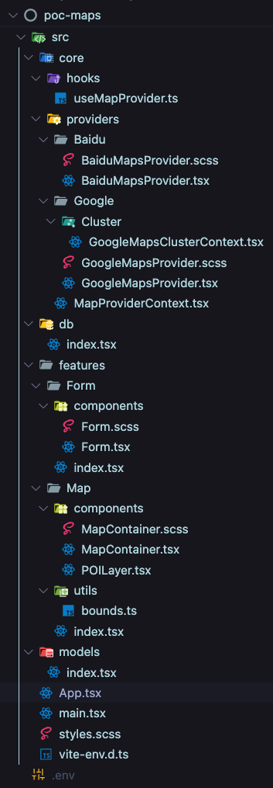
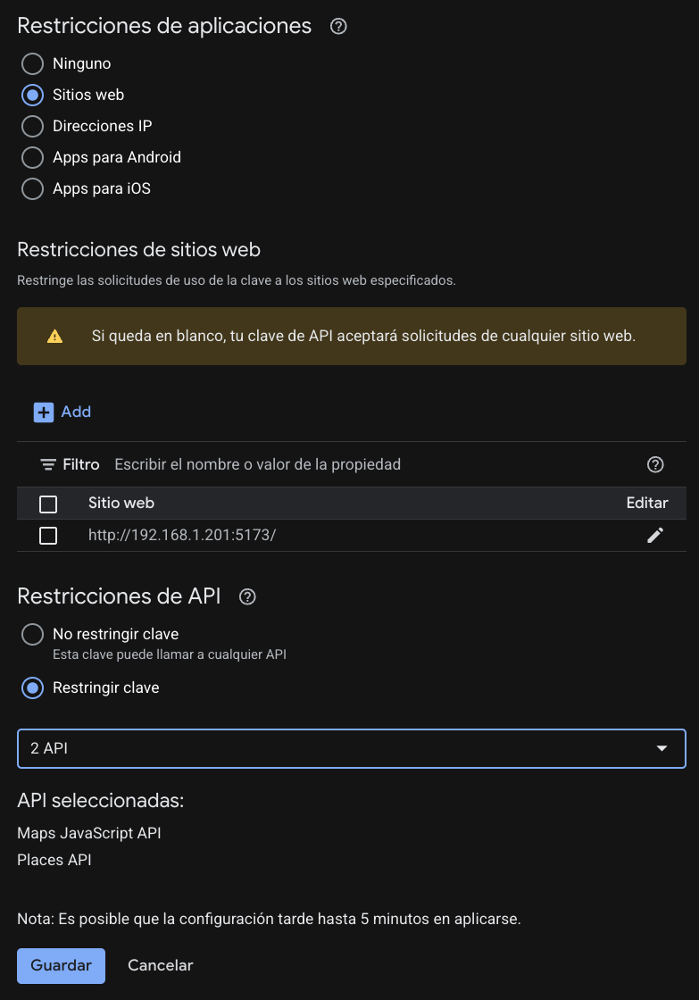

# POC Maps

## Goal

- Validate a map abstraction that can host multiple providers (Google Maps today, Baidu Maps placeholder) through a single, provider-agnostic component API.
- Showcase how the same map experience (container, layers, events) can switch providers via configuration.
- Exercise clustering, POI rendering, and basic map interactions before integrating the approach into production projects.

## Demo Links

- [Google Maps](http://192.168.1.201:5173/)
- [Baidu Maps](http://192.168.1.201:5173?country=CH)


## Project Layout

- `src/main.tsx` bootstraps the React 18 app and global styles.
- `src/core/` keeps provider-specific code and shared hooks (e.g. `useMapProvider`, Google/Baidu providers, clustering context).
- `src/features/` contains reusable feature modules:
  - `Map/` exposes `Map.Container` and `Map.POILayer` composites.
  - `Form/` renders the POC-only controls for changing center/zoom.
- `src/db/index.tsx` provides mocked POIs (stores and drop points) consumed by `Map.POILayer`.
- `src/models/index.tsx` centralizes shared types and theming helpers.



### Path Aliases

TypeScript paths (configured in `tsconfig.json`) allow concise imports:
`@providers/*`, `@features/*`, `@models/*`, and `@db/*` map to their respective folders under `src/`.

## Environment & API Keys

- Create `.env` and set the [Google](https://console.cloud.google.com/apis/credentials) credentials the POC expects:
  ```env
  VITE_GOOGLE_MAPS_API_KEY=your_api_key
  VITE_GOOGLE_MAPS_MAP_ID=your_map_id
  ```
- The dev server runs with `vite --host`, so allow both `http://localhost:5173` and `http://192.168.XXX.XXX:5173` (as configured in the original environment) in your Google Maps API key HTTP restrictions.
- It's mandatory to config in Google Cloud Console:
  - Enable **Maps JavaScript API** and **Places API** if you plan to extend the POC.
  - Config host restrictions to avoid key misuse with your dev server URL.
- Missing keys trigger a runtime error from `GoogleMapsProvider`; invalid or rate-limited keys surface Google’s default error overlay on the map canvas.



## Getting Started

1. Install dependencies (React 18, Vite 7, TypeScript, Sass, @vis.gl/react-google-maps, and @googlemaps/markerclusterer):
   ```bash
   npm install
   ```
2. Start the dev server:
   ```bash
   npm run dev
   ```
   Vite serves on `http://localhost:5173` and binds to your LAN IP because of the `--host` flag.
3. Optional scripts: `npm run lint`, and `npm run precommit` (with ESLint, Prettier, Husky, Lint Staged good practices).

## Switching Providers

- The hook `useMapProvider` inspects `window.location.search`.
  - Default provider: Google Maps.
  - `?country=CH` (uppercase check) switches to the Baidu provider stub.
- `MapProvider` wraps the feature tree with the right provider implementation while exposing the active `plugin` identifier.

### GoogleMapsProvider

- Injects Google Maps primitives via `@vis.gl/react-google-maps`.
- Guards against missing `VITE_GOOGLE_MAPS_API_KEY` / `VITE_GOOGLE_MAPS_MAP_ID` and passes callbacks (onCameraChanged, onClick, onIdle) from `Map.Container` down to the underlying map.
- Uses `GoogleMapsClusterProvider` to manage marker clustering when enabled (see [Clustering](#clustering)).

### BaiduMapsProvider (stub)

- Renders a placeholder surface explaining the missing integration while still wiring `Map.Primitives` so the rest of the app can run.
- Logs a warning on mount to signal the stub is active.

## Map Namespace

`Map` is exported as a namespace that groups the two main pieces you compose inside `App`:

### `Map.Container`

- Props: `plugin`, initial `center` and `zoom`, `onCameraChanged`, `onMapClick`, optional `onIdle`, and `children` for layers.
- Internally renders the provider’s `InfoWindow` primitive and wires event handlers:
  - `onCameraChanged` updates internal state (center, zoom) and publishes changes upstream.
  - `onMapClick` forwards the clicked lat/lng/placeId.
  - `onIdle` bubbles the map idle event (used for logging in `App`) [not tested].
- Includes a **POC-only** `FormComponent` (lat/lng/zoom inputs) to jump to new coordinates. It is intentionally minimal and not accessibility friendly; it exists purely for experimentation.

### `Map.POILayer`

- Props: array of `POI` models, optional `onPoiClick`, and optional `clustering` flag.
- Pulls `Marker` from the provider context so rendering stays provider-agnostic.
- When `clustering` is true it toggles the provider clustering state; otherwise markers render individually.

## Data & Models

- `src/db/index.tsx` mocks Oysho stores and drop points across Spain for quick testing.
- `POI` model captures id, type (`store` | `dropPoint`), coords, label, and optional metadata.
- `TypeColors` defines per-type styling used by the Google marker pins.

## App Flow & Events

- `App.tsx` selects the provider, renders `Map.Container`, and feeds the POI mock into `Map.POILayer` (with clustering enabled by default).
- App-level handlers log to the console to help visualize interactions:
  - `handleCameraChanged` prints zoom + coordinates.
  - `handleMapClick` prints position and optional `placeId`.
  - `handleOnIdle` records idle events (currently informational).
  - `handlePoiClick` highlights the selected POI both in the logs and via the floating badge rendered at the top of the viewport.

## Clustering

- `Map.POILayer` exposes a `clustering` prop (true/false) that toggles provider support.
- Google-specific logic lives in `GoogleMapsClusterProvider` (`src/core/providers/Google/Cluster/GoogleMapsClusterContext.tsx`):
  - Watches the map instance via `useMap` from `@vis.gl/react-google-maps`.
  - Creates a shared `MarkerClusterer` when the map is ready.
  - Provides `setMarkerRef` so each `GoogleMarker` can register/unregister itself.
- `GoogleMarker` only attaches clustering refs when the provider marks clustering as enabled, keeping markers lightweight otherwise.
- Baidu’s stub ignores clustering; once the real provider lands it can opt into the same contract.

## Running Without Google Maps

- If the Google script fails (invalid key, quota exceeded, network issues) the underlying Google Maps SDK renders its own failure message in the canvas.
- Because the POC wraps the Google component directly, those default overlays remain visible, making it easy to spot credential issues while developing.

## Future Enhancements

- Implement the real `BaiduMapsProvider` and parity feature set.
- Add geolocation helpers and map-bounds enforcement.
- Extend map primitives (polylines, polygons, overlays) as needed.
- Replace the experimental form with production-ready controls or extract it into dedicated showcase stories/tests.
- Add automated tests (unit + integration) for provider selection, layer rendering, and clustering toggles.

## Annex

- [Google Maps - React Platform Codelab](https://developers.google.com/codelabs/maps-platform/maps-platform-101-react-js?hl=es-419#7)
- [Google Maps API Documentation](https://developers.google.com/maps/documentation)
- [Google Maps JavaScript MarkerClusterer](https://github.com/googlemaps/js-markerclusterer)
- [Baidu Maps API Documentation](https://lbsyun.baidu.com/index.php?title=webapi)
